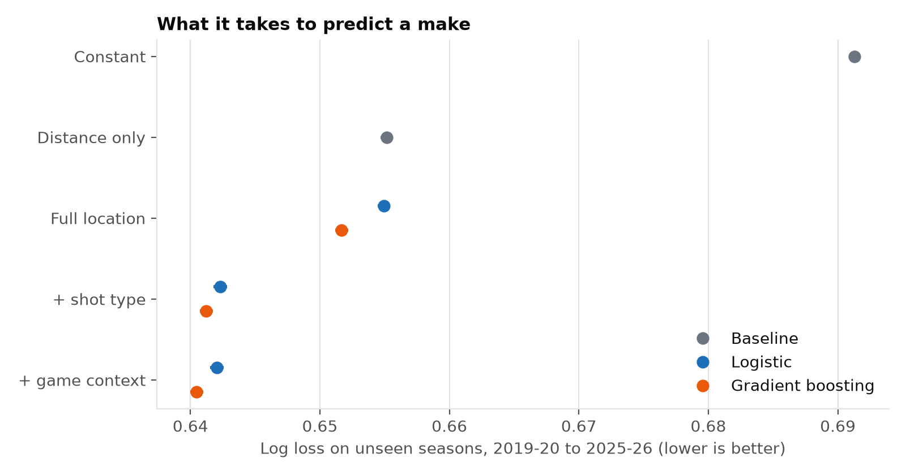
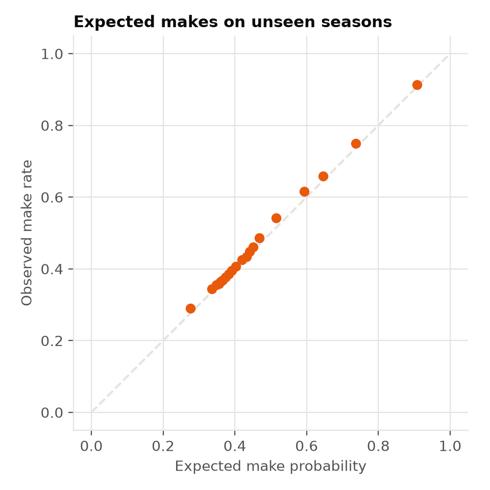
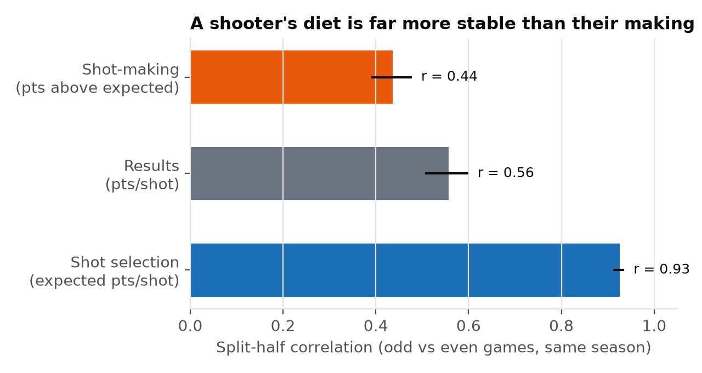
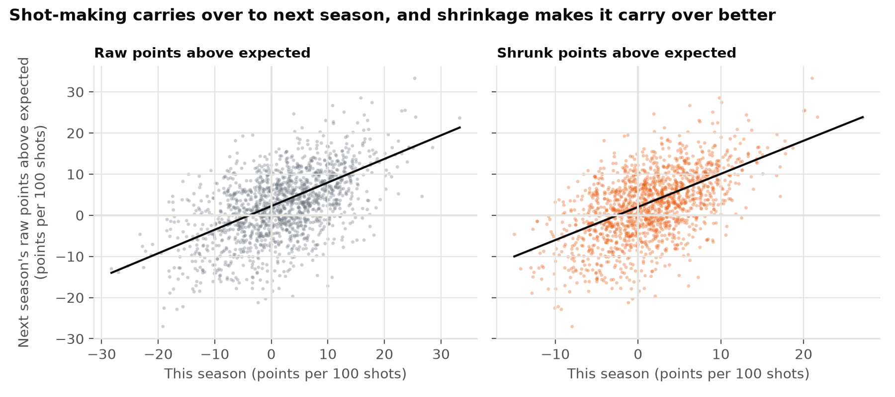
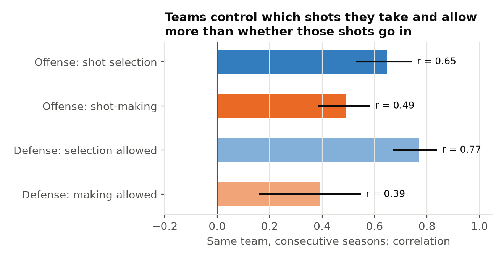

# Shot-making or shot selection? Separating the two in NBA shooting

[](https://github.com/Andresperez397/nba-shot-making/actions/workflows/ci.yml)

A player's field-goal percentage mixes two things: **which shots they take** (shot selection, or diet) and **how often those shots go in compared with what they should** (shot-making). This project builds an expected-make model, validates it on seasons it has never seen, and then asks the questions a front office or coaching staff cares about:
- How much do shooters really differ at making shots?
- Is that a stable skill or mostly noise?
- How much do teams control the shots they take and allow?

**Data:** 1,897,373 regular-season field-goal attempts, 2017-18 to 2025-26 (NBA Stats play-by-play). Test seasons are 2019-20 to 2025-26.
**Stack:** Python (scikit-learn, statsmodels, pandas). **Two-page summary:** [PDF](reports/NBA%20Shot-Making%20-%20Summary.pdf)

## Findings

**1. Where and how a shot is taken predicts makes; the game situation adds little.**
The expected-make model (gradient boosting) was trained only on earlier seasons and tested on 1,467,380 shots from seven later seasons.

| Information added | Log-loss reduction (millinats per shot) | 95% CI |
|---|---|---|
| Distance over a constant | 36.1 | 35.6–36.5 |
| Full location (x, y, angle, corner 3) | 3.5 | 3.3–3.7 |
| Shot type (dunk, layup, floater, pull-up, step-back, ...) | 10.5 | 10.2–10.7 |
| Game context (period, clock, score margin, home) | 0.8 | 0.7–0.8 |

- **Calibration:** the final model is well calibrated on unseen seasons (slope 1.03; expected calibration error 0.9 percentage points).
- **Unseen players:** it works just as well on the 130,057 shots by players it never saw.
- **Learners:** gradient boosting beat a spline logistic model at every level (by 1.1–3.3 millinats per shot). Both were tuned the same way on a held-out earlier season.





**2. Shooters really do differ at making shots, by about 7 points per 100 shots.**
- **Measure:** points above expected (PAE) = actual points minus expected points, per shot. It is shrunk toward the league with empirical Bayes, so a hot 300-shot season isn't treated like a 1,300-shot one.
- **Spread:** the true spread between shooters is about 6.4–7.6 points per 100 shots (one standard deviation), depending on the season.
- **Signal vs noise:** for player-seasons with at least 500 attempts, about 73% of the raw spread is signal and 27% is noise.
- **Leaders:** Nikola Jokić is the top shot-maker in the data. He holds the six highest shrunk seasons, led by +27 points per 100 shots in 2022-23 (95% interval ±6). Kevin Durant and Stephen Curry follow, at +17 to +19.

**3. Shot selection is far more stable than shot-making, but making is still a real skill.**
- **Split-half reliability** (odd vs even games, 2,305 player-seasons with at least 200 attempts):
  - **Shot selection:** expected points per shot, r = **0.93**.
  - **Shot-making:** points above expected, r = **0.44** (95% CI 0.39–0.48).
  - **Raw efficiency** sits in between, at r = 0.56.

  

- **Next season** (1,545 player-season pairs, 484 players):
  - **Shrunk PAE carries over.** It predicts next season's PAE better than assuming no skill (weighted MSE 0.0042 against 0.0072, difference CI above zero).
  - **Shrinkage helps.** Shrunk beats raw PAE (0.0042 against 0.0054, difference CI above zero). Shrunk PAE correlates 0.55 with next season's, while shot diet carries over at 0.86.
  - **Splitting pays off.** Predicting next season's points per shot from *diet plus shrunk making* beats using raw points per shot (difference in weighted MSE 0.00021, 95% CI 0.00009–0.00034).

  

**4. Teams control which shots they take and allow more than whether those shots go in.**
Across 180 pairs of consecutive team-seasons, the year-to-year correlations are:

| Quantity | Correlation | 95% CI |
|---|---|---|
| Offense: shot selection | 0.65 | 0.53–0.74 |
| Offense: shot-making | 0.49 | 0.38–0.58 |
| Defense: selection allowed | 0.77 | 0.67–0.84 |
| Defense: making allowed | 0.39 | 0.16–0.55 |

- **The defense hypothesis held:** defensive selection-allowed is more stable than making-allowed by 0.38 (95% CI 0.21–0.60). This was the pre-stated hypothesis.
- **What it means for evaluating a defense:** judge it more on the shots it allows than on whether opponents happen to make them.



## How it was built

1. **Data audit first** ([DATA_AUDIT.md](DATA_AUDIT.md)).
   - **Completeness:** every scheduled game has play-by-play.
   - **Leakage:** fields that reveal the result are never inputs. That covers the description text, assists (only on makes), blocks (only on misses) and the score on the shot's own row (a make's row already includes its points). The score margin before each shot is rebuilt from earlier events only, and a test checks this.
   - **Shot-type labels:** grouped into consistent families across the NBA's label changes.
2. **A frozen analysis plan** ([ANALYSIS_PLAN.md](ANALYSIS_PLAN.md)), committed before any model was fit. Every later change is in [DEVIATIONS.md](DEVIATIONS.md).
3. **A data break caught by the validation design.** On the first test season, gradient boosting with full location did *worse* than distance alone. That is a red flag, since it should never happen.
   - **Diagnosis:** dropping one input at a time traced it to the y coordinate. From 2017-18 the NBA charts rim attempts about 0.4 feet further from the basket, and the make rate at 1–2 feet jumps from 58% to 68% in one season.
   - **Fix:** the analysis window was moved to start in 2017-18 and the change documented, rather than patched by hand.
4. **Temporal validation only.**
   - **Expected makes:** for any season, they come from a model trained on earlier seasons. A player's own shots never train the model that scores them.
   - **Tuning:** both learners are tuned on a held-out earlier season. Boosting's silent early stopping is switched off and a test checks it.
5. **Uncertainty:** game-cluster bootstrap for model comparisons; player- and team-cluster bootstrap for the skill tests (1,000 resamples).
6. **Robustness checks.** The conclusions hold:
   - with location-only expected makes, which avoid scorer-assigned shot-type labels (split-half r 0.47; year-to-year 0.56; the two shot-making estimates correlate 0.96)
   - with shot-making centered within each season (league-wide make rates drift; for example, 2020-21, played mostly without fans, ran 1.2 points above expectation).
7. **Engineering:**
   - pinned requirements and data files pinned by SHA-256
   - `ruff` and 10 `pytest` tests (leakage, natural-spline construction, pre-shot score, held-out outcome corruption, warm-start equivalence, shrinkage recovery). CI runs the lint and the 9 tests that don't need the raw data on every push
   - every README number traced to a saved table by script.

## Limitations

- **No defender data.** Public play-by-play has no defender positions, so "expected" doesn't account for how well a shot was contested. Some of what is measured as shot-making is shot quality the data can't see. That may favor big men who finish uncontested and players whose teams create open looks.
- **Scorer-assigned shot types.** They are assigned after the play. The location-only check shows the conclusions don't depend on them, but the shot-type gain in finding 1 may be partly label-driven.
- **Tips and putbacks:** from 2020-21 they are placed exactly at the basket, so their location carries no information.
- **Tuning sample:** hyperparameter tuning used a 300,000-shot sample of the training seasons for both learners, to keep run time reasonable. Final models were refit on all training data.

## Reproduce

```bash
python -m venv .venv && .venv/bin/pip install -r requirements.txt
.venv/bin/python scripts/fetch_data.py     # download, verify against data/manifest.csv
.venv/bin/python scripts/data_audit.py
.venv/bin/python scripts/run_q1.py         # about 3.5 hours on 8 cores
.venv/bin/python scripts/run_skill.py
.venv/bin/python scripts/make_figures.py
.venv/bin/python -m pytest -q
```

## Data and license

- **Data:** NBA Stats play-by-play and schedules, via the sportsdataverse project (MIT-licensed repository). The data belong to the NBA and are used here for non-commercial research. Raw data are not redistributed; only derived summary tables and figures are committed.
- **Code:** MIT.
- **Affiliation:** not affiliated with or endorsed by the NBA.
